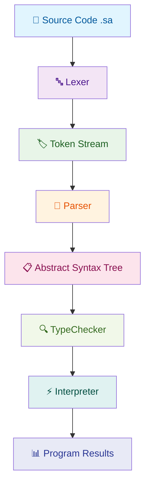

<div align="center">

# **Quantum Language** 🚀
## **Compiler Structure & Architecture Documentation**

[](https://en.wikipedia.org/wiki/C%2B%2B17)
[](#)
[](#)

> **📐 Complete architectural overview of the Quantum Language compiler system**

---

</div>

## 🌟 Overview

This document provides a **comprehensive architectural overview** of the Quantum Language compiler, detailing how all components work together to transform source code into executable programs. The documentation reflects the current state of the codebase with **enhanced features** including static type checking, reference parameters, and advanced pointer types.

---

## 🔄 Compilation Pipeline



### 📋 Pipeline Stages

| Stage | Component | Purpose | Key Features |
|-------|-----------|---------|--------------|
| **1️⃣** | **Lexer** | Tokenization | Single-pass O(n) processing, keyword recognition |
| **2️⃣** | **Parser** | AST Construction | Recursive descent + Pratt parsing, error recovery |
| **3️⃣** | **TypeChecker** | **NEW** | Static type analysis, error detection, type safety |
| **4️⃣** | **Interpreter** | Execution | Tree-walk execution, dynamic typing, native functions |

---

## 🏗️ Component Architecture

### 🔤 1. Lexical Analysis Phase

**📁 Files:** `src/lexer/`, `include/Lexer/`

**🎯 Purpose:** Convert raw source code into a stream of meaningful tokens

**⚡ Key Responsibilities:**
- 🔤 Character-by-character source processing
- 🏷️ Keyword vs identifier distinction
- 🔢 Number, string, and operator recognition
- 📝 Template literal parsing with interpolation
- 📍 Position tracking for precise error reporting
- 💬 Comment and whitespace handling
- 🔗 **Reference parameter token recognition** (`&`, `REF`)

**🎨 Design Highlights:**
- ⚡ **Single-pass O(n) tokenization** for maximum efficiency
- 🗺️ **Hash table O(1) keyword lookup** for fast identification
- 🌍 **Multi-language syntax support** (Python, JavaScript, C++)
- 🔒 **Future-proof cybersecurity keyword reservation**
- 🆕 **Enhanced token types** for reference parameter support

### 🌳 2. Parsing Phase

**📁 Files:** `src/parser/`, `include/Parser/`, `include/AST/`

**🎯 Purpose:** Transform token stream into Abstract Syntax Tree (AST)

**⚡ Key Responsibilities:**
- 📋 Recursive descent parsing for statements
- ⚖️ Pratt-style parsing for expressions with operator precedence
- 🏗️ AST node construction with position information
- 🔄 Error recovery and synchronization mechanisms
- 🎯 Support for complex language features (classes, lambdas, comprehensions)
- 🔗 **Reference parameter parsing** in function definitions

**🎨 Design Highlights:**
- 🔄 **Hybrid parsing approach** (recursive descent + Pratt)
- 📚 **Comprehensive statement and expression coverage**
- 🛡️ **Type-safe variant-based AST nodes**
- 🚀 **Extensible architecture** for new language features
- 🆕 **Enhanced function parameter parsing** with reference detection

### 🔍 3. **NEW** Static Type Checking Phase

**📁 Files:** `src/typechecker/`, `include/TypeChecker/`

**🎯 Purpose:** Perform comprehensive static type analysis and validation

**⚡ Key Responsibilities:**
- 🔍 **Type inference** and validation across all AST nodes
- 🏗️ **Type environment management** with hierarchical scoping
- ⚠️ **Type mismatch detection** with detailed error reporting
- 🔗 **Reference parameter type checking** and validation
- 📊 **Function signature analysis** and return type verification
- 🛡️ **Type safety enforcement** before execution

**🎨 Design Highlights:**
- 🌳 **Environment-based type resolution** with lexical scoping
- 📋 **Built-in function type definitions** for standard library
- ⚡ **Early error detection** before runtime execution
- 🎯 **Optional type checking** with graceful degradation
- 📝 **Comprehensive error messages** with line/column information

### ⚡ 4. Interpretation Phase

**📁 Files:** `src/interpreter/`, `include/Interpreter/`, `src/value/`, `include/Value/`

**🎯 Purpose:** Execute the AST to produce program results

**⚡ Key Responsibilities:**
- 🚶‍♂️ Tree-walk AST execution with visitor pattern
- 🎭 Dynamic type system with variant-based values
- 🔗 Lexical scoping with environment chains
- 🏗️ Object-oriented programming support
- 📚 Native function registration and execution
- 🛡️ Comprehensive standard library
- 🔗 **Reference parameter handling** and pointer type support

**🎨 Design Highlights:**
- 🛡️ **Modern C++ variant-based value system**
- 🧠 **Smart pointer memory management** for safety
- ⚡ **Exception-based control flow** for error handling
- 📚 **Extensive built-in function library**
- 🔒 **Cybersecurity-focused function set**
- 🆕 **Enhanced parameter passing** with reference semantics

---

## 📊 Data Flow Architecture

### 🏷️ Token Stream Structure
```cpp
// Lexer produces structured token stream
std::vector<Token> tokens = {
    Token(TokenType::LET, "let", 1, 1),
    Token(TokenType::IDENTIFIER, "x", 1, 5),
    Token(TokenType::COLON, ":", 1, 6),
    Token(TokenType::STRING_TYPE, "string", 1, 7),
    Token(TokenType::ASSIGN, "=", 1, 14),
    Token(TokenType::STRING, "\"hello\"", 1, 16),
    Token(TokenType::SEMICOLON, ";", 1, 23),
    Token(TokenType::EOF_TOKEN, "", 1, 24)
};
```

### 🌳 AST Structure
```cpp
// Parser creates hierarchical tree structure
ASTNode (BlockStmt) {
    statements: [
        ASTNode (VarDecl) {
            isConst: false,
            name: "x",
            typeHint: "string",
            initializer: ASTNode (StringLiteral) { value: "hello" }
        }
    ]
}
```

### 🎭 Value System
```cpp
// Interpreter uses variant-based value system
QuantumValue value = QuantumValue(42.0);                    // Number
QuantumValue str = QuantumValue("hello");                 // String
QuantumValue arr = QuantumValue(std::make_shared<Array>()); // Array
QuantumValue ptr = QuantumValue(std::make_shared<QuantumPointer>(cell, "x")); // Pointer
```

---

## 🧠 Memory Management Strategy

### 🎯 Smart Pointer Usage
| Pointer Type | Purpose | Lifetime |
|--------------|---------|----------|
| **`std::unique_ptr`** | AST node ownership | Parser → Interpreter |
| **`std::shared_ptr`** | Environment chains, closures | Reference-counted |
| **`std::shared_ptr`** | Collections and functions | Reference-counted |
| **`std::shared_ptr`** | **NEW**: Pointer cells | Reference-counted |

### 🔄 Object Lifetime Management
1. **🏷️ Tokens**: Owned by lexer → moved to parser → discarded after parsing
2. **🌳 AST Nodes**: Owned by parser → transferred to interpreter → cleaned up after execution
3. **🔗 Environments**: Shared ownership for closures → automatic cleanup when references drop to zero
4. **🎭 Values**: Reference-counted for collections and functions
5. **🆕 Pointer Cells**: Shared ownership for reference parameter implementation

---

## 🎯 Type System Architecture

### 🛡️ Dynamic Typing with Enhanced Variant
```cpp
using Data = std::variant<
    QuantumNil, bool, double, std::string,
    std::shared_ptr<Array>, std::shared_ptr<Dict>,
    std::shared_ptr<QuantumFunction>, std::shared_ptr<QuantumNative>,
    std::shared_ptr<QuantumInstance>, std::shared_ptr<QuantumClass>,
    std::shared_ptr<QuantumPointer>  // NEW: Reference parameter support
>;
```

**✅ Benefits:**
- 🛡️ **Type safety** with compile-time checking
- 💾 **Memory efficiency** (only active type stored)
- 🚀 **Extensible** for new types
- 🎯 **Pattern matching** with `std::visit`
- 🆕 **Reference semantics** for advanced programming

### 🔍 Runtime Type Checking
- **🛡️ Type Guards**: `isNumber()`, `isString()`, `isArray()`, `isPointer()`, etc.
- **🔒 Safe Access**: `asNumber()`, `asString()`, `asArray()`, `asPointer()` with validation
- **⚠️ Error Reporting**: Clear type mismatch messages
- **🆕 Pointer Operations**: Pointer-specific type checking and operations

---

## 🏗️ Object-Oriented Programming Support

### 📋 Class System
```cpp
struct QuantumClass {
    std::string name;
    std::shared_ptr<QuantumClass> base;  // Inheritance
    std::unordered_map<std::string, std::shared_ptr<QuantumFunction>> methods;
    std::unordered_map<std::string, std::shared_ptr<QuantumFunction>> staticMethods;
    std::unordered_map<std::string, QuantumValue> staticFields;
};
```

### 🎭 Instance System
```cpp
struct QuantumInstance {
    std::shared_ptr<QuantumClass> klass;
    std::unordered_map<std::string, QuantumValue> fields;  // Instance state
    std::shared_ptr<Environment> env;                       // Method closure
};
```

**✨ Features:**
- 🔗 **Single inheritance** with method resolution
- 📦 **Instance fields** and class methods
- 🎯 **Static methods** and fields
- 🔄 **Closure-based method execution**

---

## 🔗 **NEW** Reference Parameter System

### 📝 Function Signature Enhancement
```cpp
struct QuantumFunction {
    std::string name;
    std::vector<std::string> params;
    std::vector<bool> paramIsRef; // NEW: true = pass-by-reference (int& r)
    std::vector<std::string> paramTypes; // Type hints
    ASTNode *body;
    std::shared_ptr<Environment> closure;
};
```

### 🎯 Pointer Type Implementation
```cpp
struct QuantumPointer {
    std::shared_ptr<QuantumValue> cell; // Live reference to variable storage
    std::string varName;                // For display/debugging
    
    bool isNull() const;
    QuantumValue deref() const;
    void assign(QuantumValue value);
    std::string toString() const;
};
```

**🚀 Reference Parameter Features:**
- 📝 **Syntax Support**: `int& ref` parameter declarations
- 🔗 **Reference Semantics**: Modifications affect original variables
- 🛡️ **Null Safety**: Comprehensive null checking for pointer operations
- 🏷️ **Variable Name Tracking**: Enhanced debugging with variable names
- 🎯 **Type Integration**: Full integration with existing type system

---

## ⚡ Performance Optimizations

### 🚀 Compiler Optimizations
1. **⚡ Single-pass Lexing**: O(n) tokenization with minimal backtracking
2. **🌳 Efficient Parsing**: Recursive descent with Pratt parsing for expressions
3. **💾 Memory Efficiency**: Move semantics, smart pointers, variant storage
4. **🗺️ Hash Table Lookup**: O(1) keyword and variable access

### 🏃 Runtime Optimizations
1. **🔗 Environment Chain**: O(depth) variable lookup with caching opportunities
2. **🎯 Type Dispatch**: Compile-time variant dispatch for expressions
3. **⚡ Native Functions**: C++ implementations for performance-critical operations
4. **💾 Memory Layout**: Cache-friendly data structures
5. **🆕 Efficient References**: Direct variable access for reference parameters

---

## ⚠️ Error Handling Architecture

### 🌳 Exception Hierarchy
```
std::runtime_error
    └── QuantumError
        ├── RuntimeError    (execution errors)
        ├── TypeError       (type mismatches)
        ├── NameError       (undefined variables)
        ├── IndexError      (collection access)
        └── StaticTypeError (NEW: type checking errors)
```

### 📊 Error Reporting Strategy
1. **📍 Position Tracking**: Line and column for all errors
2. **📝 Context Information**: Rich error messages with expected vs actual
3. **🎨 Color Coding**: Visual distinction for different error types
4. **🔄 Recovery Mechanisms**: Attempt to continue after minor errors
5. **🆕 Enhanced Messages**: Better error reporting for reference parameter operations

---

## 📚 Standard Library Architecture

### 🔧 Native Function Registration
```cpp
void registerNatives() {
    // Mathematical functions
    env->define("sin", QuantumValue(std::make_shared<QuantumNative>(sin_impl)));
    
    // String operations
    env->define("len", QuantumValue(std::make_shared<QuantumNative>(len_impl)));
    
    // Cybersecurity functions
    env->define("sha256", QuantumValue(std::make_shared<QuantumNative>(sha256_impl)));
    
    // Type checking functions
    env->define("typeof", QuantumValue(std::make_shared<QuantumNative>(typeof_impl)));
}
```

### 📦 Library Categories
| Category | Functions | Purpose |
|----------|-----------|---------|
| **🔢 Mathematical** | sin, cos, log, sqrt | Trigonometry and calculations |
| **📝 String Operations** | len, substring, replace | Text manipulation |
| **📚 Collection Methods** | push, pop, filter | Array/dict operations |
| **📁 File I/O** | read_file, write_file | File system operations |
| **⏰ Time/Date** | now, sleep, format | Time operations |
| **🎲 Random Numbers** | rand, srand | Generation and seeding |
| **🔒 Cybersecurity** | sha256, aes128, scan_port | Security operations |
| **🆕 Type Operations** | typeof, is_number | Type introspection |

---

## 🖥️ **NEW** Enhanced CLI Features

### 🧪 Test Mode Support
```cpp
static void runTestMode(const std::string &path) {
    g_testMode = true;  // Enable non-blocking input
    // ... test execution logic with automated validation
}
```

**✨ Test Mode Features:**
- 🚫 **Non-blocking Input**: `input()` returns empty string in test mode
- 🤖 **Automated Testing**: Designed for CI/CD pipelines
- ✅ **Clear Output**: Success/failure indication with color coding
- 🌐 **Global Flag**: `g_testMode` affects interpreter behavior

### 📁 Enhanced File Operations
- 📂 **Filesystem Library**: Uses `std::filesystem` for modern file operations
- ⚠️ **Better Error Messages**: More informative file-related error reporting
- 🔍 **Extension Validation**: Checks for `.sa` extension with warnings

---

## 🔧 Extensibility Design

### ➕ Adding New Language Features
1. **🔤 Lexer**: Add new token types to `TokenType` enum
2. **🌳 Parser**: Add parsing methods for new constructs
3. **📋 AST**: Add new node types to `NodeVariant`
4. **🔍 TypeChecker**: Add type checking rules for new constructs
5. **⚡ Interpreter**: Add execution methods for new nodes
6. **🎭 Value System**: Add new types to `QuantumValue` variant

### 🔧 Adding New Native Functions
1. **💻 Implementation**: Create C++ function with proper signature
2. **📝 Registration**: Add to `registerNatives()` method
3. **📖 Documentation**: Update function documentation
4. **🧪 Testing**: Add unit tests for new functionality

### 🔗 Adding New Reference Types
1. **🎯 Pointer Structure**: Define new pointer-like types
2. **🎭 Variant Integration**: Add to `QuantumValue` variant
3. **🛡️ Type Methods**: Add type checking and accessor methods
4. **⚡ Operations**: Implement dereferencing and assignment operations

---

## 🌍 Cross-Platform Considerations

### 🪟 Windows Support
- 🔤 **UTF-8 Console**: SetConsoleOutputCP(CP_UTF8) for proper Unicode
- 📄 **Line Endings**: Handle both `\n` and `\r\n`
- 📁 **Path Handling**: Windows path separator considerations

### 🐧 Unix/Linux Support
- 🎨 **ANSI Colors**: Full terminal color support
- ⚡ **Signals**: Proper handling of SIGINT (Ctrl+C)
- 📁 **File System**: Unix-style path handling

---

## 🔒 Security Considerations

### 🛡️ Input Validation
- 📄 **Source Code**: Validate input before processing
- 📁 **File Access**: Restrict file system access in sandboxed mode
- 🌐 **Network Operations**: Control network access in cybersecurity functions

### 🧠 Memory Safety
- 🧠 **Smart Pointers**: Prevent memory leaks and dangling pointers
- 🔍 **Bounds Checking**: Array and string access validation
- 🛡️ **Type Safety**: Runtime type checking prevents type confusion
- 🆕 **Pointer Safety**: Comprehensive null checking for reference operations

---

## 🧪 Testing Strategy

### 🧪 Unit Testing
- **🔤 Lexer**: Tokenization accuracy for all token types
- **🌳 Parser**: AST generation for all language constructs
- **🔍 TypeChecker**: Static type analysis and error detection
- **⚡ Interpreter**: Execution correctness for all operations
- **🎭 Value System**: Type operations and conversions
- **🆕 Reference Testing**: Reference parameter testing with various scenarios

### 🔄 Integration Testing
- **🔄 End-to-End**: Complete program execution
- **⚠️ Error Handling**: Proper error reporting and recovery
- **⚡ Performance**: Benchmarking critical operations
- **💾 Memory**: Leak detection and usage profiling
- **🆕 Test Mode**: Test mode validation and automation

---

## 🚀 Future Evolution

### 📋 Planned Enhancements
1. **⚡ JIT Compilation**: Just-in-time compilation for performance
2. **🔍 Enhanced Static Analysis**: Advanced type checking and linting
3. **🐛 Debugger**: Step-through debugging with breakpoints
4. **📦 Package Manager**: Module distribution and dependency management
5. **💻 IDE Integration**: Language server protocol support
6. **🔗 Advanced References**: More sophisticated reference type features

### 🏗️ Architecture Scalability
- **🧩 Modular Design**: Clean separation enables independent component evolution
- **🔄 Interface Stability**: Well-defined APIs support backward compatibility
- **⚡ Performance Headroom**: Architecture supports significant performance improvements
- **🚀 Feature Extensibility**: Clean patterns support adding new language features
- **🔗 Reference System**: Framework for advanced parameter passing features

---

## 🏆 Why This Architecture Works

### 🎯 Comprehensive Design
- **📚 Complete Language Support**: All modern language features implemented
- **⚠️ Robust Error Handling**: Comprehensive error reporting and recovery
- **⚡ Performance Optimized**: Efficient algorithms and data structures
- **👤 User Experience**: Professional CLI and helpful error messages
- **🆕 Advanced Features**: Static type checking and reference parameters

### 🛡️ Modern C++ Best Practices
- **🛡️ Type Safety**: Variant-based system prevents runtime errors
- **🧠 Memory Management**: RAII and smart pointers prevent leaks
- **⚡ Performance**: Move semantics and efficient data structures
- **🔧 Maintainability**: Clean separation of concerns and modular design

### 🎯 Domain-Specific Features
- **🔒 Cybersecurity Focus**: Specialized functions for security tasks
- **🌍 Multi-language Syntax**: Familiar syntax from multiple languages
- **🛠️ Professional Tools**: Comprehensive CLI and development experience
- **🚀 Extensibility**: Architecture supports future growth and evolution
- **🔗 Advanced Programming**: Reference parameters for sophisticated use cases

---

<div align="center">

## 🎉 Conclusion

The **Quantum Language compiler architecture** demonstrates modern C++ best practices applied to language implementation, creating a **robust, efficient, and user-friendly** development tool specifically designed for cybersecurity applications, now enhanced with **static type checking** and **advanced parameter passing capabilities**.

---

### ⭐ **Key Architectural Achievements**

- **🔍 Static Type Checking** - Early error detection and type safety
- **🔗 Reference Parameters** - Advanced parameter passing semantics
- **⚡ High Performance** - Optimized algorithms and data structures
- **🛡️ Memory Safety** - Comprehensive smart pointer usage
- **🎯 Professional UX** - Clean CLI and helpful error messages
- **🔒 Security Focus** - Cybersecurity-specific features and considerations

---

*Built with **🧠 Modern C++** and **❤️** for the cybersecurity community*

</div>
